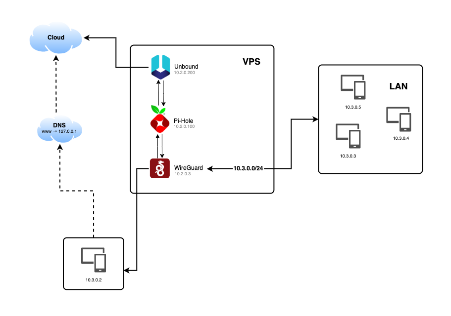
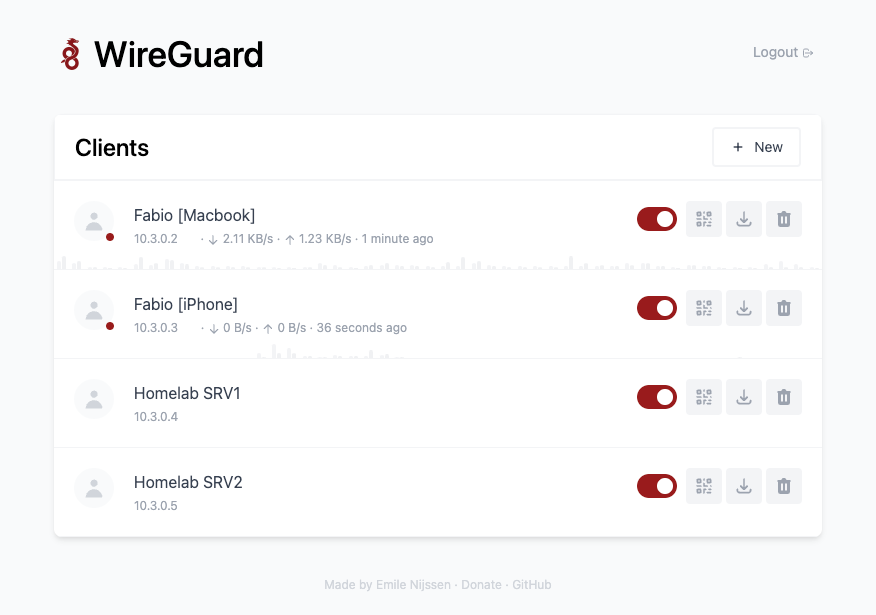

# WireHole VPN/DNS

WireHole is a docker-compose project that combines WireGuard, Pi-Hole, and Unbound to facilitate the deployment and management of a full or split-tunnel VPN. This setup not only provides a VPN with ad-blocking via Pi-Hole but also enhances DNS privacy and caching through Unbound.



## Quickstart

Before you begin, ensure that Docker is installed on your system.
To get started with WireHole, follow these steps:

```bash
#!/bin/bash

# WireHole Setup Script

# Clone the WireHole repository from GitHub
git clone https://github.com/fabioassuncao/wirehole.git

# Change directory to the cloned repository
cd wirehole

# Update the .env file with your configuration
cp .env.example .env
nano .env  # Or use any text editor of your choice to edit the .env file

# Replace the public IP placeholder in the .env
sed -i "s/REPLACE_ME_WITH_YOUR_PUBLIC_IP/$(curl -s ifconfig.me)/g" .env

# Start the Docker containers
docker compose up
```

Remember to set secure passwords for  `WG_PASSWORD`, and `PIHOLE_PASSWORD` in your `.env` file.


## Configuration

The `.env` file contains a set of environment variables crucial for configuring the WireHole services within the Docker containers. Below is a detailed explanation of each variable:

### General Settings

Update the `.env` file.

- `WG_HOST` is your public ip or domain.
- `WG_PASSWORD` is wireguard UI password.
- `PIHOLE_PASSWORD` pihole UI password.

### WireGuard Settings

- After the `docker compose up` or deploy, open your browser and go to <http://YOUR_PUBLIC_IP:51821/>
- Login with your password, which is in the `.env`
- Create new connection keys/QR codes...



### Pi-hole Settings

- Connect to VPN with created client QR code or conf file and then go to this address on your browser <http://10.2.0.100/admin>
- Login with your password, which is in the `.env`

### Recommended Configuration / Split Tunnel

For a split-tunnel VPN, configure your WireGuard client `AllowedIps` to `10.3.0.0/24`, which will route only the web panel and DNS traffic through the VPN.


###### Acknowledgements

Credit to LinuxServer.io for their maintenance of the Wireguard image and other contributions to the project.

## Contributing

1. Fork this repository!
2. Create your feature from the **develop** branch: git checkout -b feature/my-new-feature
3. Write and comment your code
4. Commit your changes: `git commit -am 'Add some feature'`
5. Push the branch: `git push origin feature/my-new-feature`
6. Make a pull request to the branch **develop**

## Credits

* [Fábio Assunção](https://github.com/fabioassuncao)
* [All Contributors](../../contributors)